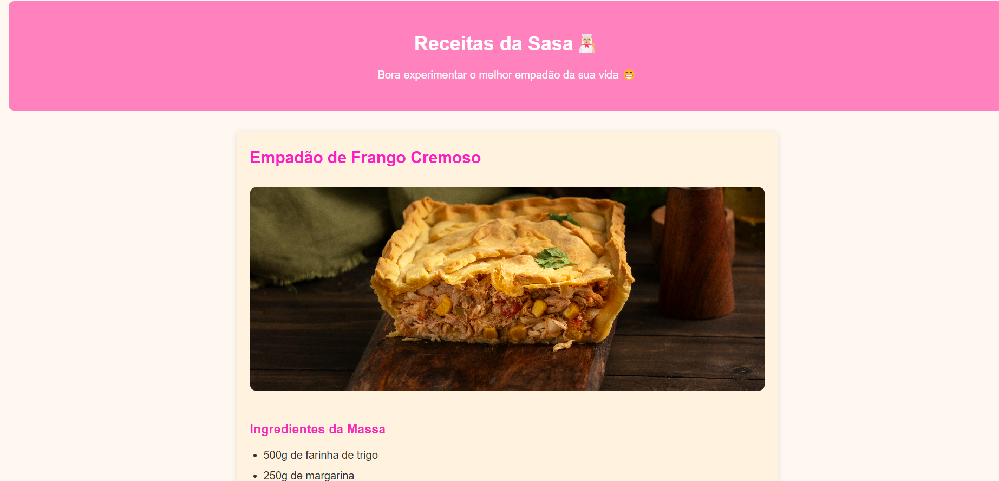
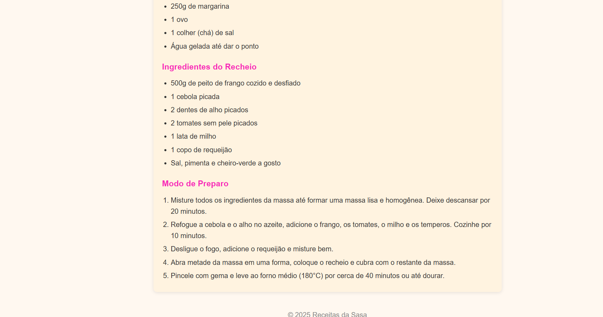

# projeto_frond_end_sasa# 🍴 Receitas da Sasa - Empadão de Frango

Projeto de uma página de receita feito em **HTML** e **CSS**, apresentando o melhor **Empadão de Frango Cremoso**.  


## 📄 Descrição

Na pagina tem:

- Um cabeçalho com o nome do site e uma descrição divertida
- Imagem ilustrativa do empadão
- Ingredientes da massa e do recheio
- Passo a passo de preparo
- Rodapé com direitos autorais

A prática é:

- Estruturação de conteúdo com HTML5
- Estilização com CSS3
- Uso de fontes externas do [Google Fonts](https://fonts.google.com/)


## 🛠️ Sites que eu usei foi

- HTML5
- CSS3
- Google Fonts (Poppins)

## 📷 Print do meu projeto

> 
> 

## 🚀 Como usar

1. Clone o repositório:
   ```bash
   git clone https://github.com/sahsteskii/projeto_frond_end_sasa.git
